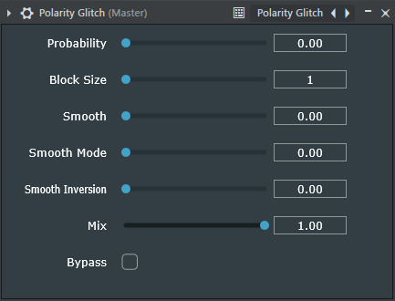

# Polarity Glitch

## Overview

Polarity Glitch is an innovative audio plugin that creates unique glitchy, 
metallic sounds by randomly inverting the polarity of the input signal based on probability settings. 
By manipulating signal polarity at the block level with customizable parameters, 
it offers a fresh approach to sound design and audio processing.

## Download
Please go to the Gumroad page for download: [link]

We only provide VST3 now, but since we use the JUCE C++ framework,
you can build other supported plugin formats as you want.
However, for some formats like AAX or VST2, you may need to obtain the corresponding SDK yourself.

### Disclaimer
This plugin is still in development and does not provide any kind of warranty, use at your own risk!

## Snapshot


## Core Functionality
- Random polarity inversion per audio block based on probability settings
- Adjustable block size from 1 to 512 samples
- Deterministic randomization - identical results for the same timeline position

### Controls
- **Block Size**: Define the granularity of polarity inversion (1-512 samples)
- **Smooth**: Control interpolation at polarity inversion points
  - Transition length = Block Size × Smooth value
- **Smooth Mode**: Blend between linear and sinusoidal interpolation
- **Smooth Inversion**: Blend between normal interpolation and inverted interpolation
- **Mix**: Balance between wet (processed) and dry (original) signals
- **Bypass**: Quick A/B comparison toggle

## Use Case
This approach is relatively new, and its use cases are still being explored.

Some use case I found are listed below:
- Add retro noise characteristics to sounds.
- Create lo-fi textures and ambiance.
- Add tonality and movements to kicks.
- Add unique noise and characteristics to leads and make it wider
- Bass Amplifier (with wave shaper after it to saturate the sound).

Also, if you find any cool use case of this plugin and want to share with me, you can DM me on X (Twitter).
https://x.com/ABlackCat_04_/


## How to Build
Clone Polarity Glitch from GitHub
```bash
git clone https://github.com/ablackcat04/Polarity-Glitch.git
```

Polarity Glitch depends on the JUCE GitHub submodule, 
```bash
cd Polarity-Glitch
git submodule update --init --recursive
```
Since we use CMake in this project, you can go for your favorite way to build a CMake project.


### Notes
Use the Visual Studio toolchain instead of MinGW on Windows
